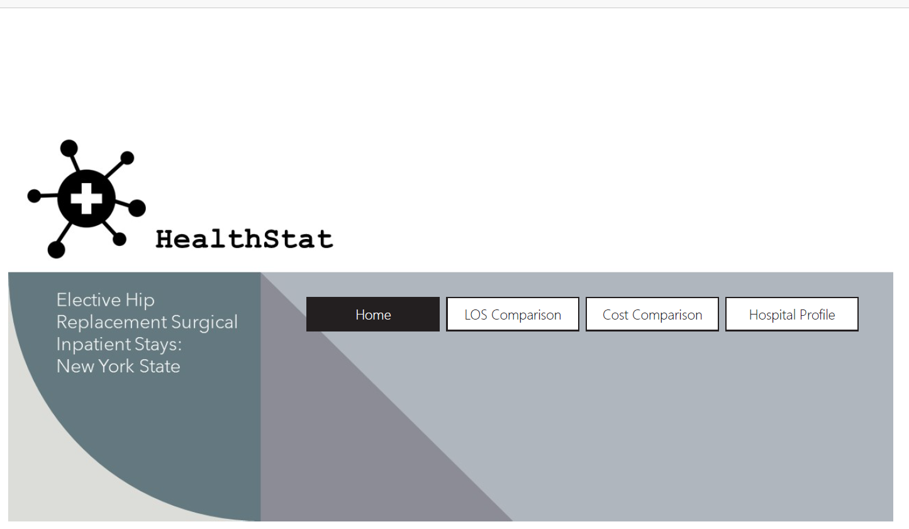
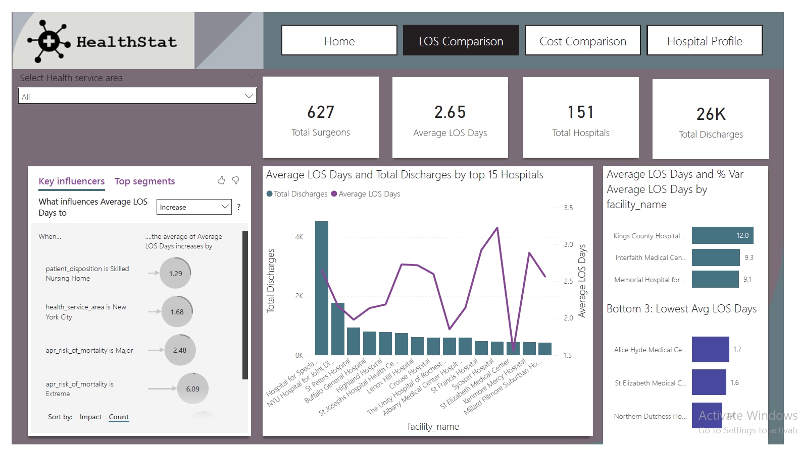
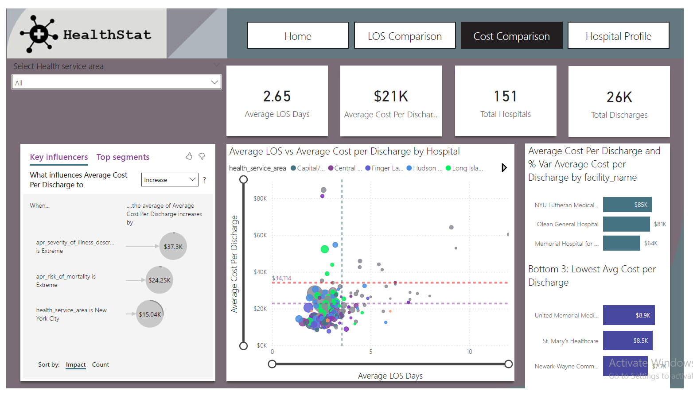
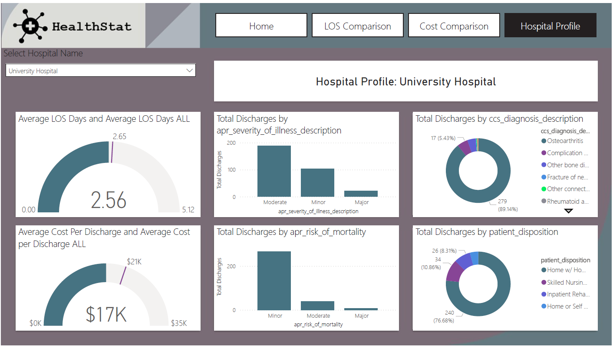

# HealthStat: New York State Elective Hip Replacement Analytics

## 📋 Project Overview
HealthStat is an advanced Power BI dashboard designed to analyze and benchmark **Elective Hip Replacement Surgical Inpatient Stays** across New York State. The project focuses on optimizing healthcare delivery by evaluating two critical hospital performance metrics: **Length of Stay (LOS)** and **Average Cost Per Discharge**. 

By establishing statewide baselines, this dashboard allows hospital administrators and healthcare analysts to identify cost outliers, efficiency bottlenecks, and the core drivers behind extended inpatient stays.

---

## 🚀 Key Features & Layout

The interactive report consists of 4 core views designed for seamless navigation:

### 1. Home Page

* Minimalist, professional landing page featuring an intuitive navigation bar to guide users across different analysis modules.

### 2. LOS Comparison

* Evaluates efficiency across **151 hospitals** and **627 surgeons**.
* Employs the **Key Influencers AI visual** to reveal what factors (such as a 'Major' or 'Extreme' risk of mortality) drive up patient length of stay.
* Tracks the top 15 hospitals by discharge volume alongside their corresponding average LOS.

### 3. Cost Comparison

* Dissects the **$21K statewide average cost per discharge** across **26K total discharges**.
* Features a scatter plot analysis comparing *Average LOS vs. Average Cost per Discharge* to isolate high-cost, low-efficiency regional facilities.
* Highlights the top and bottom performing hospitals based on cost variance against the state baseline.

### 4. Hospital Profile

* A granular, single-facility deep dive (e.g., University Hospital) utilizing dynamic Gauge charts.
* Compares the specific hospital's performance directly against the **Statewide Average (ALL)** for both cost and LOS.
* Categorizes clinical profiles by severity of illness, risk of mortality, primary diagnosis descriptions, and post-discharge patient disposition.

---

## 🛠️ Data Modeling & DAX Measures

To create dynamic benchmarks that adapt to user filtering while preserving global state averages, advanced DAX logic was implemented.

### Core DAX Measures Included:

* **Statewide Benchmarking (Ignoring Filters):**
```dax
  Average Cost per Discharge ALL = 
  CALCULATE(
      [Average Cost per Discharge],
      ALL()
  )
```

### Variance Analysis against Baseline:
```dax
  % Var Average Cost per Discharge = 
  CALCULATE(
      DIVIDE(([Average Cost Per Discharge] - [Average Cost per Discharge ALL]), [Average Cost per Discharge ALL])
  )
```
### Dynamic UI Title Generation:
```dax
  Title Selected Facility = 
  "Hospital Profile: " & VALUES(hospital_inpatient_discharges_totalhipreplacement[facility_name])
```

### Engineered Columns & Summary Tables:

**Age Bins:** Grouped patient demographics into a binary format (Age 50+ vs Age <50) to evaluate risk exposure profiles.

**Surgical Program Summary Table:** Created a summarized table using SUMMARIZECOLUMNS to classify program sizes based on discharge volume thresholds (<200, 200-399, 400-599, >=600).
 
## 💡 Key Analytical Insights

- **Statewide Baselines:** The standard baseline for an elective hip replacement in NY State sits at an **Average LOS of 2.65 days** and an **Average Cost of $21K**.
- **Primary Cost Drivers:** According to the machine learning Key Influencers analysis, when a patient's **severity of illness is classified as Extreme**, the average cost per discharge spikes drastically by **+$37.3K**.
- **Discharge Impact on Efficiency:** Patients discharged to a **Skilled Nursing Home** experience an average increase of **1.29 days** in LOS compared to standard home discharges, highlighting a major operational transition bottleneck.
- **Extreme Outliers:** While the state average cost is $21K, peak outlier facilities reach as high as **$85K per discharge** (e.g., NYU Lutheran Medical Center), signaling a severe need for cost standardization.
